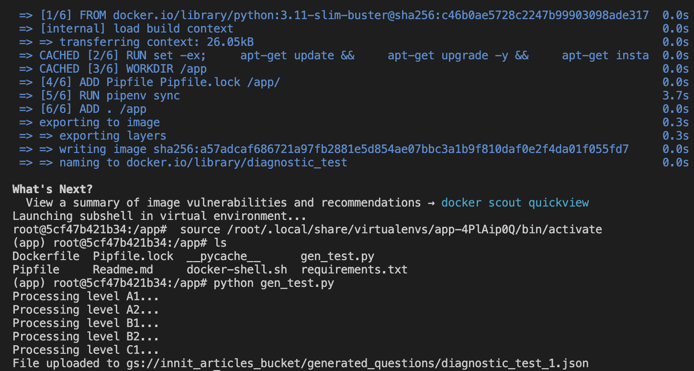

Here's a refined version of your README:
# Diagnostic Test

## Overview
This script generates a diagnostic test by randomly selecting 10 multiple-choice questions from the question bank, with 2 questions from each of the 5 proficiency levels (A1, A2, B1, B2, C1). The diagnostic test evaluates the user's language level.

## Instructions

### 1. Start the Docker Container
To set up the required environment, run the following command:

```bash
sh docker-shell.sh
```

This starts the Docker container and prepares it for running the scripts.

### 2. Generate the Diagnostic Test

#### For News Articles:
1. Use the following command to generate the test:
   ```bash
   python gen_test.py
   ```

2. The script will:
   - Fetch question data from Google Cloud Storage.
   - Randomly select and combine the questions into a test.
   - Upload the generated test to the GCP bucket at `innit_articles_bucket/generated_questions/diagnostic_test.json`.

3. An example screenshot of the running script:
   
