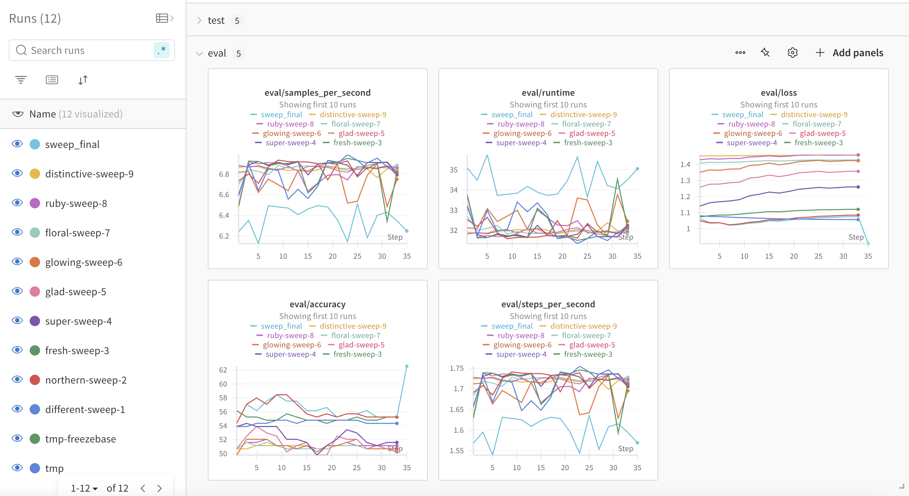

# DeBERTa Model Fine-Tuning with Gemini-Generated Samples

This module contains scripts for further fine-tuning the DeBERTa model using samples generated by Gemini.

## Build Container

To build the container, run:

```bash
sh docker-shell.sh
```

## Model Training

We process the generated dataset into a PyTorch dataset and upload it to GCP in the folder 'train_dataset_generated':

```bash
python make_dataset.py
```

All generated samples are used for fine-tuning the model, with the validation and test sets kept the same as the original model (from web scraping) to ensure evaluation consistency.

## Learning Rate Optimizing

A lower learning rate than the initial model will be used. We apply a sweep in WandB to optimize the learning rate via Bayesian search. To run the experiments, use:

```bash
python sweep_lr.py --wandb_key <Your WandB API Key> --n_trials <Number of trails>
```

This script performs the following:

- Loads trained model weights from the GCP bucket
- Runs `n_trials` experiments on WandB using a sweep

The results will be visible in your WandB workspace.



Make sure to replace \<Your WandB API Key\> with your actual WandB API key.

## Finetune Model

After analyzing the experiment results, select the best learning rate and re-run the fine-tuning process:

```bash
python finetune.py --wandb_key <Your WandB API Key> --run_name<Run Name> --lr<Set Learning Rate>
```

This script does the following:

- Reads train (generated), validation, test dataset from GCP bucket.
- Finetunes the model on train (generated) with the set learning rate.
- Saves the finetuned model weights locally.
- Uploads the finetuned weights to GCP bucket.
