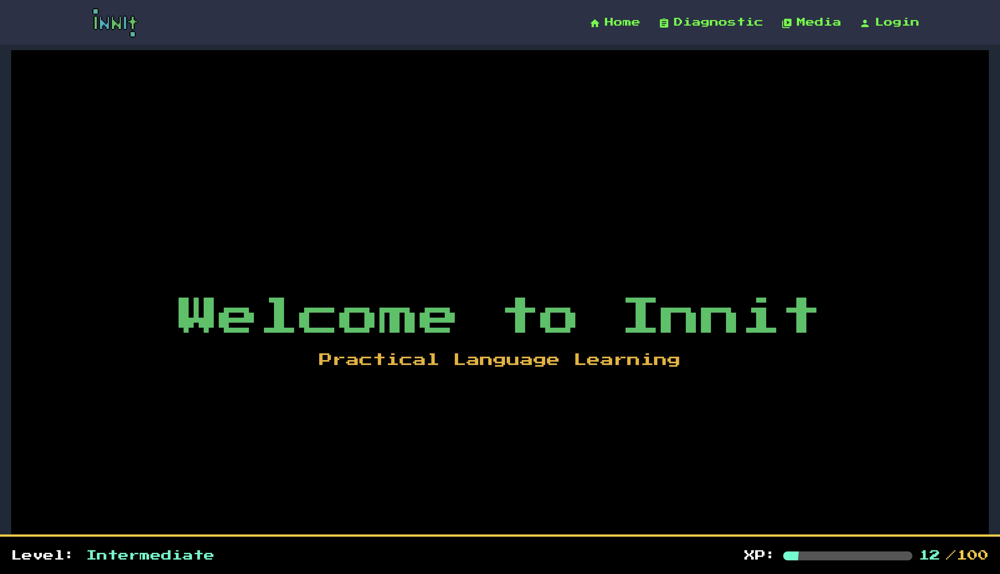
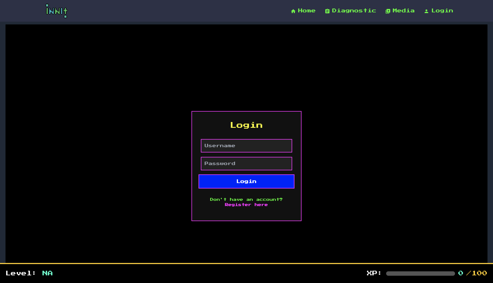
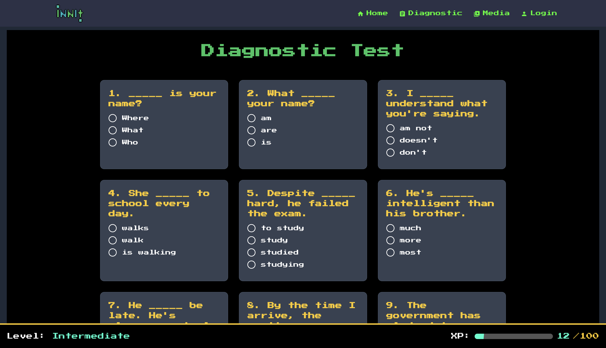
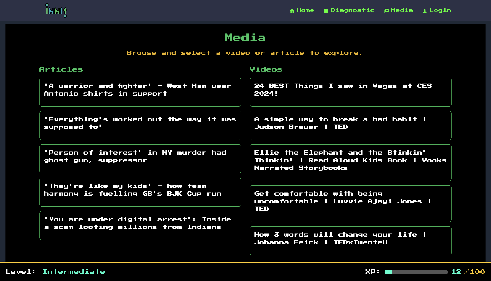
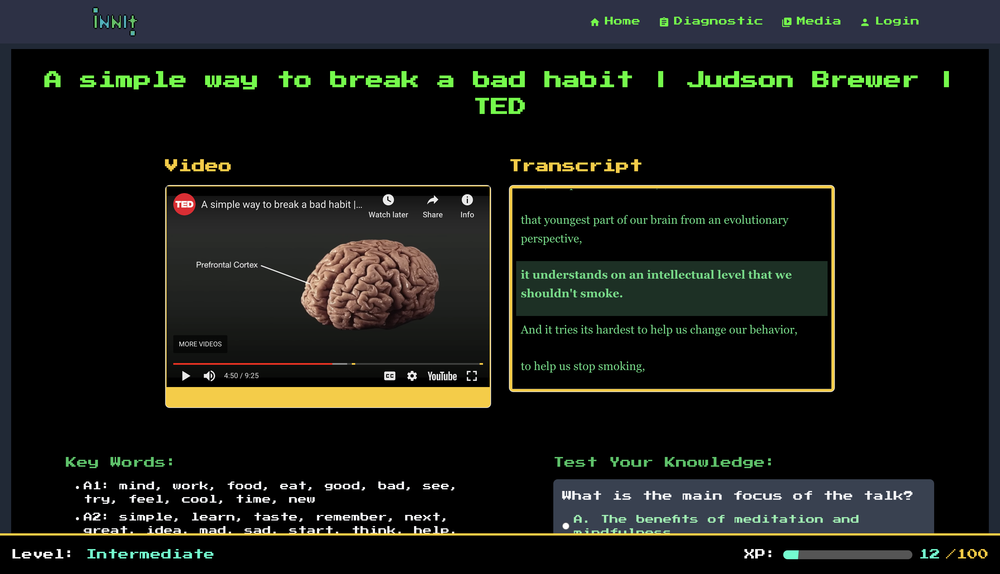

# Frontend-shivas

This module contains the jsx code for the pages and components for the frontend. It is built upon the template code provided by Shivas (hence the name).

## Build Container

Note: for full functionality make sure to run the backend container by going over to the [api-service-shivas](../api-service-shivas/README.md) folder and follow those instructions!

To build the frontend container, run:

```bash
sh docker-shell.sh
```

Then type in the command:

```bash
npm run dev
```

## View Frontend

Then you will be able to view the website at:

```bash
http://localhost:3000
```

Here are some screenshots that show the main pages/functionality of the website.

Home page:


Login page:

We have added user functionality so visitors can now create users and login/logout whenever they want and their user data will be stored.

Diagnostic page:

This is where users will found out what their language level is.

Media page:

This is where users will see their recommended media at their appropriate language level.

Example video:

This is an example of a recommended youtube video. It is synced with its transcript on the right hand side and it also has extra features for the user to interact with the content including key words, summary, and a test yourself section. The articles page is analogous to this one with an article instead of a video with its transcript.
