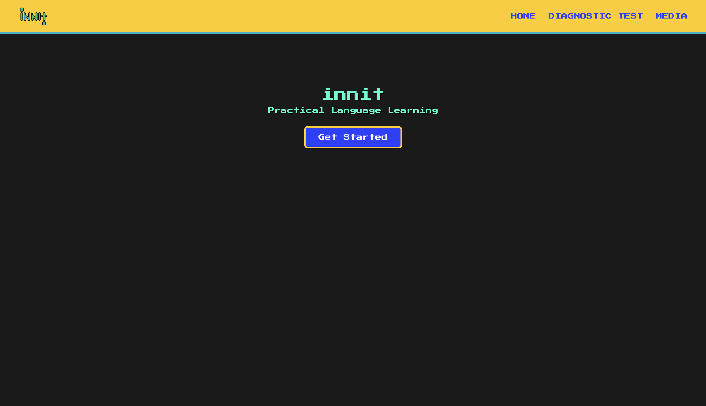
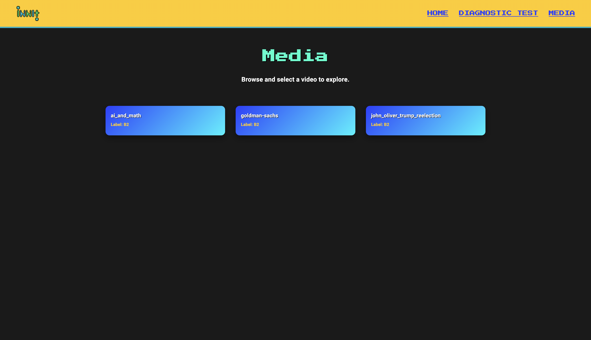
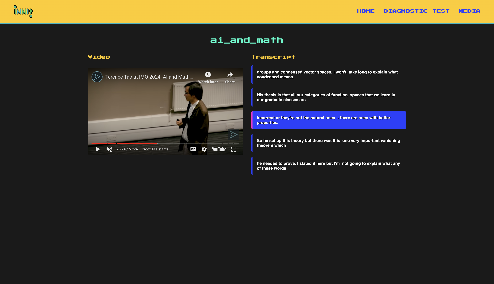

# Frontend

This module contains the jsx code for the pages and components for the frontend.

## Build Container

Note: before you run this container, head over to the [api-service](../api-service/README.md) folder and follow those instructions first if you have not done so already!

To build the container in "development mode", run:

```bash
sh docker-shell-dev.sh
```

Otherwise, to build the container in "production mode", run:

```bash
sh docker-shell.sh
```

## View Frontend

Then you will be able to view the website at:

```bash
http://localhost:3000
```

Here are some screenshots that show the main pages/functionality of the website.

Home page:


Media page:

This is where users will see their recommended media at their appropriate language level.

Example video:

This is an example of a recommended youtube video. It is synced with its transcript on the right hand side.
