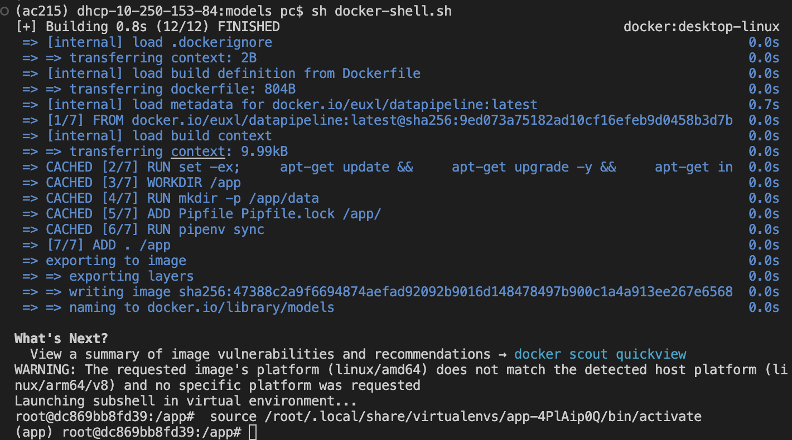

# DeBERTa Model Training and Inference

This repository contains scripts for training and inference using the `"microsoft/deberta-v3-small"` model. The training script uploads the trained model weights to a Google Cloud Storage (GCS) bucket, and the inference script uses the saved weights to make predictions.

For detailed steps on fine-tuning, please refer to [fine_tuning_process.md](./fine_tuning_process.md).


## Build Container

To build the container, run:

```bash
sh docker-shell.sh
```



## Model Training

To train the model, run the following command:

```bash
python train_model.py --wandb_key <Your WandB API Key>
```

This script does the following:
- Reads train, validation, test dataset from GCP bucket.
- Finetunes the "microsoft/deberta-v3-small" model on the train dataset.
- Saves the trained model weights locally.
- Uploads the trained weights to the specified GCP bucket.

Make sure to replace <Your WandB API Key> with your actual WandB API key.


## Inference
To run inference, execute:

```bash
python infer_model.py
```
This will:

- Download the model weights from GCS.
- Load the test dataset from the disk.
- Print out the predicted labels for the test dataset.
