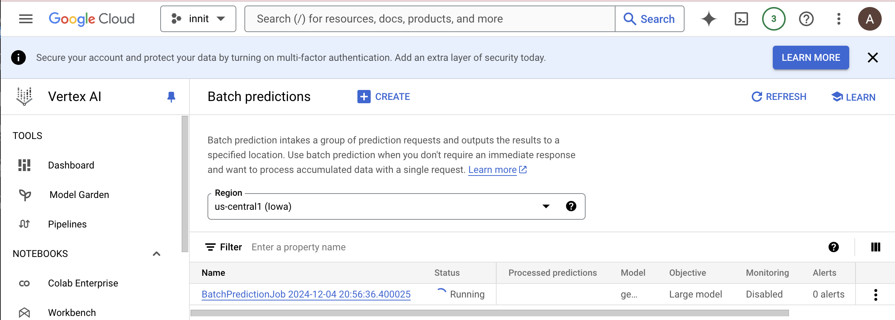
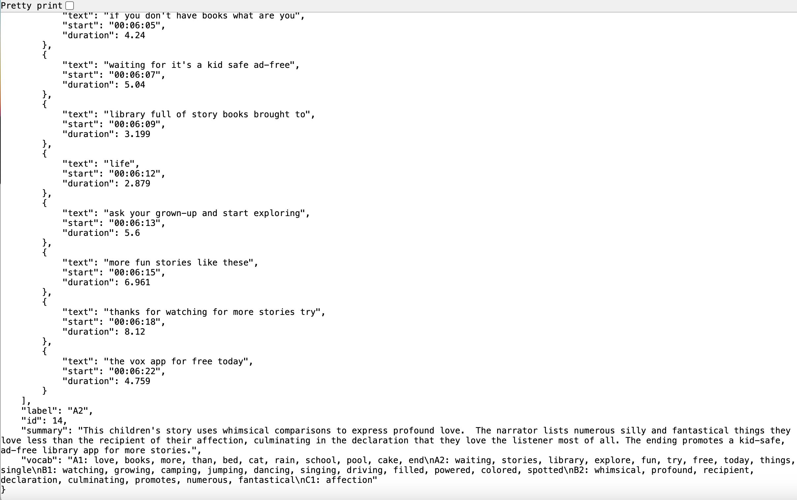

# Summary and Vocabulary Generation

## Overview
This project uses Gemini to generate summaries and lists of key vocabularies, categorized by level, for news articles and video transcripts.

## Instructions

### 1. Starting the Docker Container
To start the Docker container, run the following command:

bash
sh docker-shell.sh

This initializes the environment required for running the scripts.

### 2. Generating Summaries and Vocabulary

#### For News Articles:
1. Run the following script to start batch prediction in GCP and generate summaries, vocabularies, and Q&A for news articles by level:
   bash
   python summary_vocab_news.py
   
Example batch prediction:

2. Extract the results and organize them into level-specific folders:
   bash
   python extract_results_news.py
   

   - This script creates level-specific folders and stores the news articles as JSON files.
   - The generated summaries, vocabularies, Q&As are appended as key-value pairs to these JSON files and saved in GCP.

Example output file:

#### For YouTube Transcripts:
1. Run the following script to start batch prediction in GCP and generate summaries, vocabularies and Q&As for YouTube transcripts:
   bash
   python summary_vocab_yt.py
   

2. Extract the results and organize them into level-specific folders:
   bash
   python extract_results_yt.py
   

   - This script creates level-specific folders and stores the transcripts as JSON files.
   - The generated summaries, vocabularies and Q&As are appended as key-value pairs to these JSON files.

### 3. Results
After running the scripts, you will have the following:
- Summarized content, key vocabularies, and Q&As categorized by level.
- JSON files stored in level-specific folders, updated with summary, vocabulary and Q&A data.

Here's the refined README file in a structured and professional format:

---

### 4. Prompts

The *prompt* used for generating the outputs is structured as follows:

python
prompt = (
    f"ID: {id}\n"
    f"Please summarize the following content in under 100 words, wrapping the summary in `<sum>` tags. "
    f"After the summary, extract key vocabulary from the content, categorized by CEFR levels (A1, A2, B1, B2, C1), and wrap the vocabulary section in `<vocab>` tags. "
    "Each category should include a comma-separated list of words representative of that level, with no phrases or multi-word terms. "
    "Format the vocabulary as follows:\n"
    "<vocab>\n"
    "A1: word1, word2, word3\n"
    "A2: word1, word2, word3\n"
    "B1: word1, word2, word3\n"
    "B2: word1, word2, word3\n"
    "C1: word1, word2, word3\n"
    "</vocab>\n"
    "\nAfter the vocabulary, generate exactly {N_QUESTIONS} questions related to the content, wrapping the questions in `<questions>` tags. "
    "Each question should include:\n"
    "- The question text\n"
    "- Three answer choices (A, B, C)\n"
    "- The correct answer (e.g., \"A\")\n"
    "- The CEFR level (A1, A2, B1, B2, C1)\n"
    "\nFormat the questions as a JSON array following this structure:\n"
    "<questions>\n"
    "[\n"
    "    {\n"
    '        "question": "Question text?",\n'
    '        "choices": ["A", "B", "C"],\n'
    '        "answer": "A",\n'
    '        "level": "A1"\n'
    "    },\n"
    "    {\n"
    '        "question": "Question text?",\n'
    '        "choices": ["A", "B", "C"],\n'
    '        "answer": "B",\n'
    '        "level": "B1"\n'
    "    }\n"
    "]\n"
    "</questions>\n"
    "\nHere is the content:\n"
    f"{content}"
)

### Parameters:
- *{content}*: The input text or video transcript to be processed.
- *{id}*: A unique identifier for the content, used for mapping the output back to the original input.
- *{N_QUESTIONS}*: The number of questions to be generated.

#### System Instructions
The *system instruction* provides guidelines for generating outputs:

python
system_instruction = (
    "You are a highly skilled language assistant specializing in summarization, CEFR-based vocabulary categorization, and question generation. "
    "When provided with content:\n"
    "1. Generate a summary in under 100 words, and wrap it in <sum> tags.\n"
    "2. Extract key vocabulary from the content, categorized by CEFR levels (A1, A2, B1, B2, C1), and wrap this section in <vocab> tags.\n"
    "   - Present the vocabulary in the format: {level}: comma-separated vocabulary.\n"
    "   - Ensure each level contains appropriate vocabulary with words representative of that level.\n"
    "   - The vocabulary should consist of single words only (no phrases or multi-word terms).\n"
    "3. Generate a specified number of questions (e.g., 5) based on the content, wrapping them in <questions> tags.\n"
    "   - Each question should include:\n"
    "     - The question text\n"
    "     - Three answer choices (A, B, C)\n"
    "     - The correct answer (e.g., \"A\")\n"
    "     - The CEFR level (A1, A2, B1, B2, C1)\n"
    "   - Format the questions as a JSON array, following this structure:\n"
    '     <questions>\n'
    '     [\n'
    '         {\n'
    '             "question": "Sample question?",\n'
    '             "choices": ["Option A", "Option B", "Option C"],\n'
    '             "answer": "A",\n'
    '             "level": "A1"\n'
    '         },\n'
    '         {\n'
    '             "question": "Another sample question?",\n'
    '             "choices": ["Option A", "Option B", "Option C"],\n'
    '             "answer": "B",\n'
    '             "level": "B1"\n'
    '         }\n'
    '     ]\n'
    '     </questions>\n'
    "Ensure all output is clear, structured, and accurately formatted as requested."
)

#### Results Processing

The generated results are wrapped using custom tags (<sum>, <vocab>, <questions>) for easy extraction. These are subsequently parsed and inserted into the original transcript files in a structured JSON format as key-value pairs.