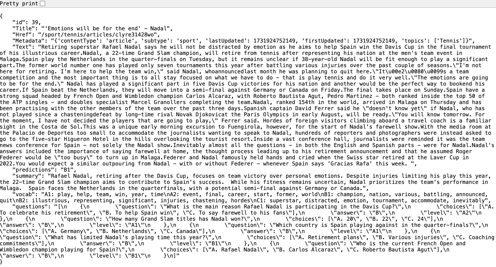

# Summary and Vocabulary Generation

## Overview
This project uses Gemini to generate summaries and lists of key vocabularies, categorized by level, for news articles and video transcripts.

## Instructions

### 1. Starting the Docker Container
To start the Docker container, run the following command:

```bash
sh docker-shell.sh
```

This initializes the environment required for running the scripts.

### 2. Generating Summaries and Vocabulary

#### For News Articles:
1. Run the following script to start batch prediction in GCP and generate summaries, vocabularies, and Q&A for news articles by level:
   ```bash
   python summary_vocab_news.py
   ```
Example batch prediction:


2. Extract the results and organize them into level-specific folders:
   ```bash
   python extract_results_news.py
   ```

   - This script creates level-specific folders and stores the news articles as JSON files.
   - The generated summaries, vocabularies, Q&As are appended as key-value pairs to these JSON files and saved in GCP.

Example output file:




#### For YouTube Transcripts:
1. Run the following script to start batch prediction in GCP and generate summaries, vocabularies and Q&As for YouTube transcripts:
   ```bash
   python summary_vocab_yt.py
   ```

2. Extract the results and organize them into level-specific folders:
   ```bash
   python extract_results_yt.py
   ```

   - This script creates level-specific folders and stores the transcripts as JSON files.
   - The generated summaries, vocabularies and Q&As are appended as key-value pairs to these JSON files.

### 3. Results
After running the scripts, you will have the following:
- Summarized content, key vocabularies, and Q&As categorized by level.
- JSON files stored in level-specific folders, updated with summary, vocabulary and Q&A data.

