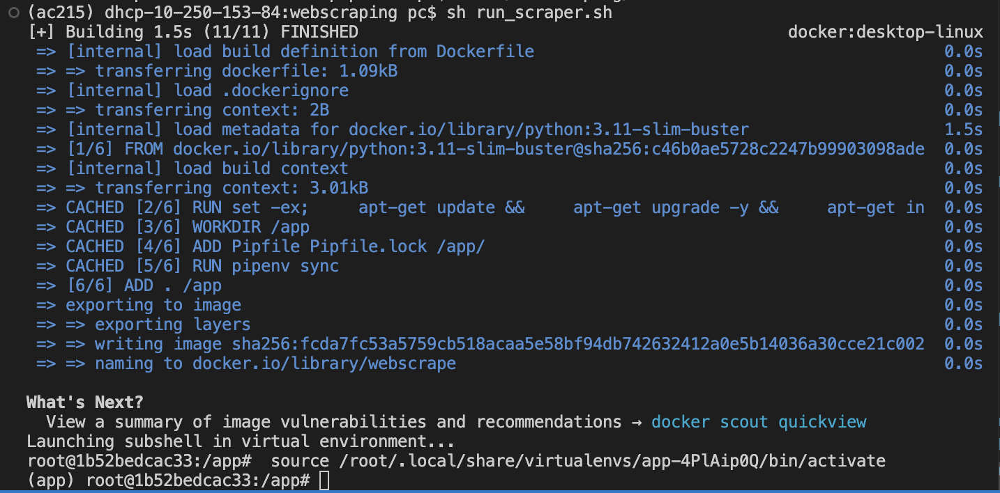

# Scraping Module

## Overview

This module is designed to scrape transcripts (video, audio, reading, and speaking) from the following websites:

- [LearnEnglish (British Council)](https://learnenglish.britishcouncil.org)
- [LearnEnglish Teens (British Council)](https://learnenglishteens.britishcouncil.org)

Each scraped transcript is paired with its corresponding proficiency level, categorized as one of the following:

- `A1 Elementary`
- `A2 Pre-intermediate`
- `B1 Intermediate`
- `B2 Upper Intermediate`
- `C1 Advanced`

Additionally, each transcript is tagged with a topic label. The collected data is saved in JSON format and uploaded to a Google Cloud Platform (GCP) bucket named `innit_articles_bucket`. The blobs are named as follows:

- `scraped_all_content.json`
- `scraped_all_content_teens.json`

## Instructions

### 1. Running the Container

To start the container, execute the following command:

```bash
sh run_scraper.sh
```



Inside the running container, scrape the links to all available content by executing:

```python
python scrape_all_links.py
python scrape_all_transcripts.py
```
